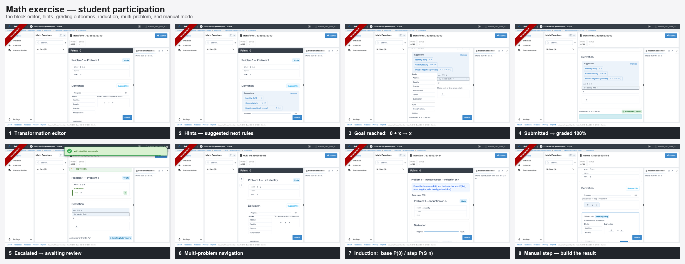
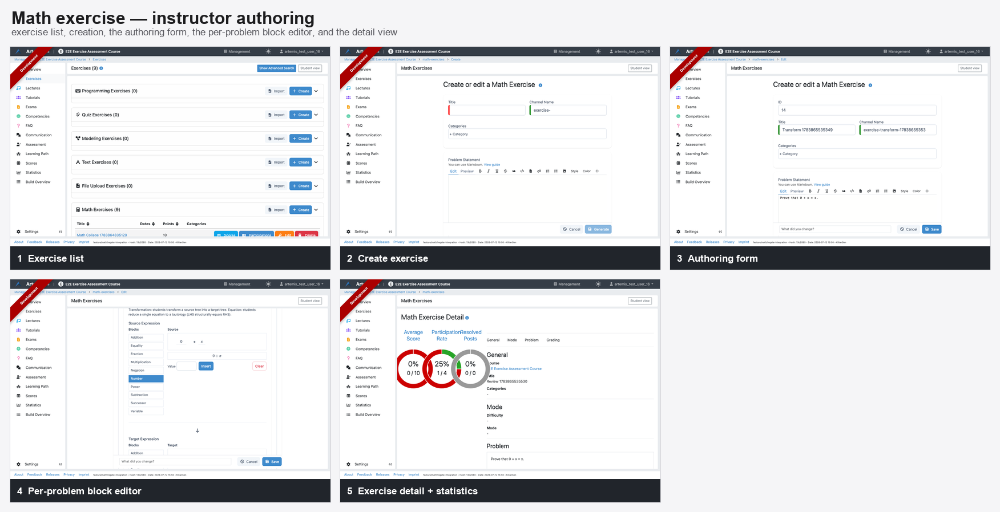
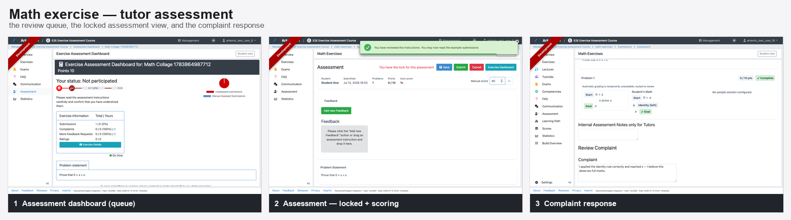

# Abgabe — Math Exercises (Equational Reasoning)

This branch adds a new **Math exercise type** to Artemis. Students prove or transform mathematical
expressions step by step in an interactive block editor; submissions are graded automatically and only
escalate to a human tutor when automatic grading is inconclusive.

This file is the entry point for reviewing the submission: a quick setup, how to run the tests, where the
code lives, and a short tour of the feature. For the full narrative walkthrough with screenshots see the
instructor documentation page: [`documentation/docs/instructor/exercises/math-exercise.mdx`](documentation/docs/instructor/exercises/math-exercise.mdx).

---

## 1. Quick setup

### Prerequisites

- **Java 25**, **Node 24**, **pnpm 11** (`corepack enable`), and **Docker** (used for the database and for the
  test suites via Testcontainers).

### Run it

```bash
# One command: starts the Spring Boot server (:8080) and builds + serves the Angular client
./gradlew bootRun

# Or, for faster client iteration, run them separately:
./gradlew bootRun -x webapp     # server only, on :8080
pnpm install                    # first time
pnpm start                      # Angular dev server on :9000 (HMR)
```

Open the app, log in, and either **create a Math exercise** as an instructor (Course Management →
Exercises → *Create a new math exercise*) or **participate** as a student.

### Remote grading backends (optional)

Math exercises are graded by either:

- the **in-process rewrite-chain grader** (`REWRITE_CHAIN`) — needs **nothing extra**; or
- one of four **remote Regate provers** (`eggregate`, `leanregate`, `coqregate`, `cvc5regate`) — reached over
  HTTP and run as separate services (the *Regate* project, **not** part of this hand-in).

Point Artemis at the remote backends with environment variables (empty by default):

```bash
export ARTEMIS_REGATE_EGGREGATE_URL=http://localhost:8000
export ARTEMIS_REGATE_CVC5REGATE_URL=http://localhost:8003
# leanregate / coqregate analogous
```

Without them, everything still works: a submission routed to a remote grader whose backend is unavailable is
**escalated to manual tutor review** rather than failed — this is the intended behaviour and is what the
review/assessment flow demonstrates.

---

## 2. Running the tests

### Server (requires Docker — PostgreSQL via Testcontainers)

```bash
# The whole math test tree
./gradlew test --tests "de.tum.cit.aet.artemis.math.*" -x webapp

# Or the key classes individually
./gradlew test --tests "de.tum.cit.aet.artemis.math.MathSubmissionIntegrationTest" -x webapp
./gradlew test --tests "de.tum.cit.aet.artemis.math.MathExerciseIntegrationTest" -x webapp
./gradlew test --tests "de.tum.cit.aet.artemis.math.MathGradingRecoveryServiceTest" -x webapp
```

The `Live*` / `MathRegateAsyncGradingLiveTest` classes are **env-guarded**: they only run when a Regate
backend URL is provided (e.g. `REGATE_LIVE_URL` / the `ARTEMIS_REGATE_*_URL` variables) and are otherwise
skipped — so the default suite runs without any external backend.

### Client (Vitest)

```bash
pnpm run vitest:run "app/math/"     # all math client specs
```

### End-to-end (Playwright)

```bash
./run-e2e-tests-local-fast.sh --filter "Math"
```

Specs: `MathExerciseParticipation`, `MathExerciseAssessment`, `MathExerciseManagement`
(`src/test/playwright/e2e/exercise/math/`).

---

## 3. Where the code lives

| Area | Path |
| --- | --- |
| Server (domain, graders, Regate client, services, REST, repositories, DTOs) | `src/main/java/de/tum/cit/aet/artemis/math/` |
| Client — participation | `src/main/webapp/app/math/participate/` |
| Client — authoring | `src/main/webapp/app/math/manage/update/` |
| Client — assessment | `src/main/webapp/app/math/manage/assess/` |
| Client — detail / list | `src/main/webapp/app/math/manage/detail/`, `.../manage/exercise/` |
| Database migrations | `src/main/resources/config/liquibase/changelog/` (`math_*` tables) |
| Instructor documentation | `documentation/docs/instructor/exercises/math-exercise.mdx` |
| E2E tests | `src/test/playwright/e2e/exercise/math/` |

---

## 4. What was implemented

- **Exercises with multiple problems.** Goal modes: **Transformation** (rewrite a start expression into a
  target), **Equation** (prove both sides equal), and **Induction** (prove a statement over a variable).
- **Interactive block editor** for building derivations, with **hints** (suggested rules), a **manual step**
  mode, and **quiz-style navigation** across problems.
- **Grading:** the in-process rewrite-chain engine plus four remote Regate provers, on fast/slow lanes.
- **Durable asynchronous grading:** the grading job is persisted so a server restart mid-grade recovers;
  the result is pushed to the student over a websocket.
- **Escalation to manual review:** an inconclusive or failed automatic verdict is never scored zero — it is
  sent to a tutor. The student sees an *"awaiting tutor review"* state, and instructors see a review-queue
  count.
- **Tutor assessment workflow:** a review queue on the standard assessment dashboard, **soft locking** (no
  two tutors on the same submission), draft vs. submit, and cancel.
- **Complaint-response loop:** a student can complain about an assessment; a different tutor or an instructor
  reviews and accepts/rejects it, revising the score.
- **Curated starter templates** in the authoring form so instructors can begin from a basic
  equational-reasoning problem instead of a blank canvas.
- **Tests:** Java integration + unit tests, client Vitest specs, Playwright E2E, and env-guarded live tests
  against the real Regate backends.

---

## 5. A two-minute tour

1. **Instructor:** create a Math exercise, pick a **starter template** (e.g. *Left identity of addition*),
   and save.
2. **Student:** open the exercise, select the `Identity (left)` rule and apply it to the `0 + x` expression to
   reach the goal `x`, then **submit** — with the in-process grader the score appears immediately.
3. **Escalation (optional):** set a problem's grader to a remote backend that isn't running, submit, and
   watch it become *"awaiting tutor review"*; then pick it up from **Assessment → the exercise's dashboard**,
   score it, and submit.

---

## 6. Visual overview

Student participation:



Instructor authoring:



Tutor assessment:


